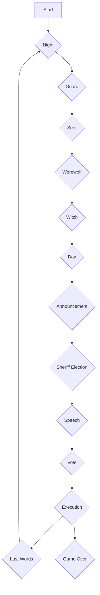

```mermaid
graph TD
    A[Start] --> B{Night};
    B --> C{Guard};
    C --> D{Seer};
    D --> E{Werewolf};
    E --> F{Witch};
    F --> G{Day};
    G --> H{Announcement};
    H --> I{Sheriff Election};
    I --> J{Speech};
    J --> K{Vote};
    K --> L{Execution};
    L --> M{Last Words};
    M --> B;
    L --> N{Game Over};
```
